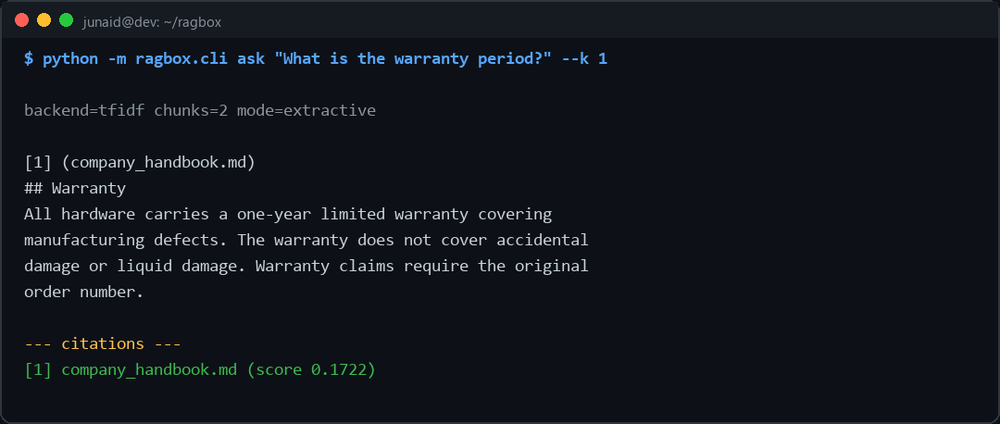
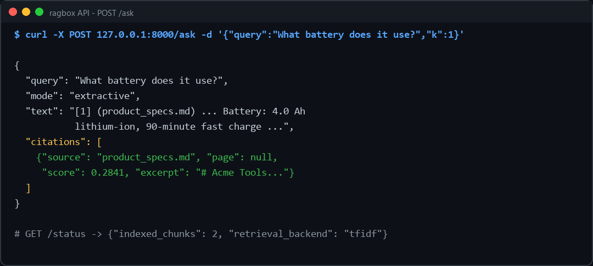

# ragbox — document Q&A with citations (RAG)

Ask questions of your own documents (PDF, Markdown, text) and get answers **with citations to
the exact source and page**. A complete Retrieval-Augmented Generation service: FastAPI backend,
pluggable retrieval, pluggable answering — engineered so the demo always runs, with zero API keys.

```
documents ──▶ ingest ──▶ chunk ──▶ index ──▶ retrieve top-k ──▶ answer + citations
 (.pdf .md .txt)        (overlapping)  (TF-IDF │ embeddings)   (extractive │ LLM)
```

## It works

CLI — ask a folder of documents, get cited passages:



API — the same engine over FastAPI (interactive docs at `/docs`):



## Design decisions (the interesting part)

- **Pluggable retrieval.** A TF-IDF baseline (scikit-learn, no heavy deps) is always available;
  if `sentence-transformers` is installed, dense semantic search is used automatically. Same
  interface, graceful degradation — the service never breaks because a model is missing.
- **Pluggable answering.** `extractive` mode returns the most relevant passages verbatim with
  citations and needs **no API key**. `llm` mode composes an answer with Claude, grounded ONLY
  in retrieved passages (the prompt forbids outside knowledge — that's the point of RAG), and
  falls back to extractive if no key is set.
- **Citations are first-class.** Every answer carries source file, page, relevance score, and
  excerpt. An answer you can't trace is an answer you can't trust.
- **Honest tests.** The suite includes an `xfail` documenting the known TF-IDF limitation
  (pure paraphrases like "money back" vs "refund") — the exact case the embedding backend
  exists to solve. Tests state what each component can and cannot do.

## Quickstart

```bash
pip install -r requirements.txt

# CLI — ask the bundled sample document
python -m ragbox.cli ask "What is the refund policy?"

# API
uvicorn ragbox.api:app --reload
# then open http://127.0.0.1:8000/docs
```

API endpoints: `POST /upload` (add a document) · `POST /ask` (`{"query": ..., "k": 4, "mode":
"extractive"|"llm"}`) · `GET /status`.

Optional extras: `pip install sentence-transformers` (semantic retrieval) ·
`pip install anthropic` + `ANTHROPIC_API_KEY` (LLM answers).

## Docker

```bash
docker build -t ragbox .
docker run -p 8000:8000 -v ./my_docs:/app/sample_docs ragbox
```

## Tests

```bash
python -m pytest tests/ -q
```

---
Built by **M. Junaid Shahid** — Python backend & AI tooling.
Portfolio: [junaidshahid-dev.github.io](https://junaidshahid-dev.github.io) ·
Related: [mcp-apex-server](https://github.com/junaidshahid-dev/mcp-apex-server) ·
[hydra-brain](https://github.com/junaidshahid-dev/hydra-brain)
